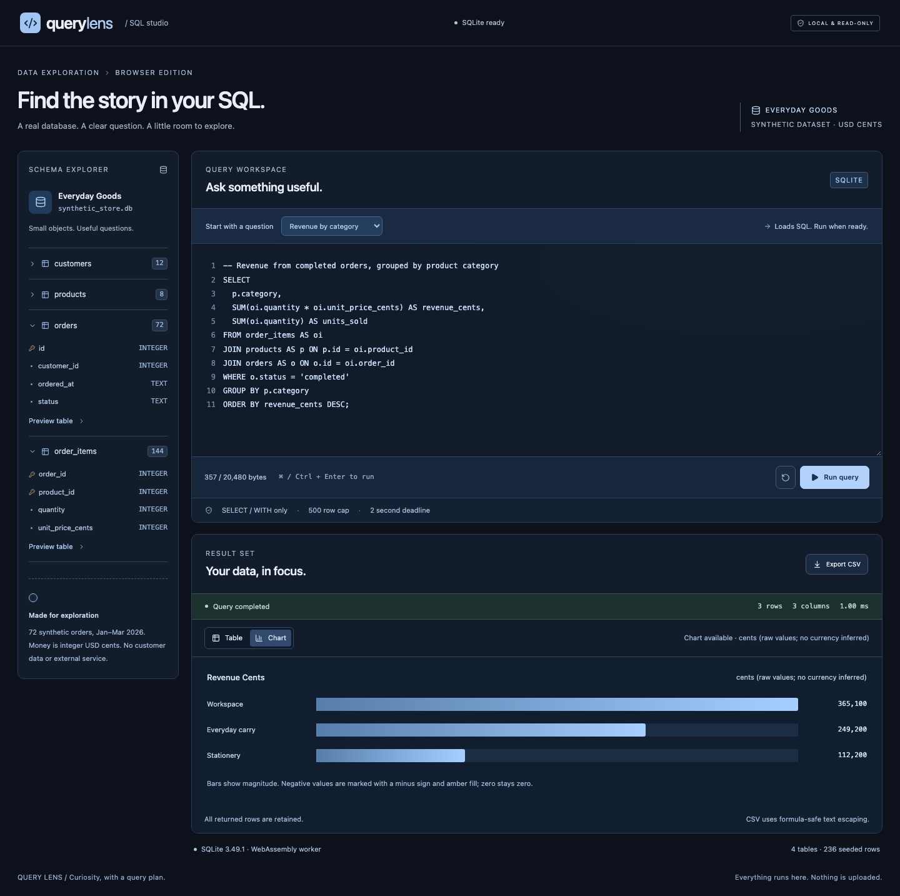

# Query Lens

**Find the story in your SQL.**

Query Lens is a browser SQL workbench backed by real SQLite WebAssembly in a dedicated worker. Explore a synthetic store, run your own queries, inspect actual rows and charts, and export spreadsheet-safe CSV. No login, API key, backend or runtime CDN.



[Mobile screenshot](docs/screenshots/mobile.png) · [Architecture](docs/ARCHITECTURE.md) · [Security](docs/SECURITY.md) · [Scaling design](docs/SCALABILITY.md) · [Decision records](docs/DECISIONS.md)

**[Open the live demo](https://nen-io.github.io/query-lens/)** · [CI checks](https://github.com/nen-io/query-lens/actions)

## Start locally

```sh
nvm use
npm ci
npm run dev
```

Open `http://127.0.0.1:4308`. Node 24 is required. The npm-pinned sql.js package supplies both JavaScript and its locally bundled WASM binary.

```sh
npx playwright install chromium
npm run check
npm run test:e2e
```

| Command                                  | Purpose                                                           |
| ---------------------------------------- | ----------------------------------------------------------------- |
| `npm run dev`                            | Vite development server on loopback port 4308                     |
| `npm run typecheck`                      | Strict TypeScript check                                           |
| `npm test`                               | Actual SQLite, SQL policy, CSV, chart and worker lifecycle tests  |
| `npm run build`                          | Typecheck and static bundle including local WASM                  |
| `npm run check`                          | Typecheck, unit/integration tests and build                       |
| `npm run test:e2e`                       | Chromium journeys plus production repository-subpath verification |
| `npx prettier --check src tests scripts` | Pinned formatter check                                            |

Browser tests also start a production fixture host at `http://127.0.0.1:4408/query-lens/`. This verifies worker and WASM URLs beneath a repository prefix; it is not a deployment service.

## A two-minute walkthrough

1. Expand a schema table. Column types and row counts come from the actual seeded database. **Preview table** edits SQL and waits for your explicit Run.
2. Run the default **Revenue by category** query. Workspace returns **365,100 cents**, Everyday carry **249,200**, and Stationery **112,200**. Those are real SQL results from disclosed synthetic records, not application throughput claims.
3. Switch to **Chart** to see the same values. Cents remain raw cents; the app does not silently convert or infer a currency from arbitrary custom SQL.
4. Choose **City totals**, **Top products**, **Order detail**, **Monthly revenue** or **Missing contact details**. Choosing an example changes the editor only. Press **Run query** or **Ctrl/Cmd+Enter** to execute it.
5. Try `SELECT '臺北; coffee' AS label, 42 AS answer;`. Quoted semicolons are valid. Two statements, writes, PRAGMAs and attach commands are rejected.
6. Run a syntax error. The previous successful output stays visible with a clear **Previous result** label. Correct the query and run again.
7. Download CSV. Column order, Unicode, quotes and line breaks are preserved; dangerous spreadsheet text prefixes are neutralized. SQL NULL exports as an empty CSV cell.

## Engineering worth opening

- Real SQLite 3.49.1 via **sql.js 1.14.2**, bundled locally and run off the main thread.
- Native `query_only` protection plus a token-aware command policy and native single-statement parsing.
- A real two-second main-thread watchdog: timeout/cancel terminates the worker, fences old replies and reseeds a fresh database.
- Measured worker query duration; 500-row cap with a 501st-row truncation check.
- Finite result validation, exact large integer display, bounded cells/columns/result bytes and a native SQLite heap guard.
- Synthetic customers/products/orders/order_items dataset with integer USD cents and ISO dates.
- Safe text rendering, accessible textarea, keyboard controls, contained table scrolling and real desktop/mobile screenshots.
- Detailed reasoning, threat model, resource model and decision records. No fabricated load benchmark.

## Deliberate limits

Only a conservative read-only SELECT/WITH subset is supported. Arbitrary database import, schema writes, transaction management and filesystem/extension functions are outside scope. Each query is ≤20 KiB, returns at most 500 retained rows/40 columns/1 MiB, and has a two-second deadline. Individual text cells are ≤16 KiB; BLOBs are ≤8 KiB and shown as hex. SQLite's native allocation guard is 32 MiB and does not cap the entire browser process.

Query text/results stay in memory and disappear on reload. Worker replacement resets the same fixed seed; there is no durable database or user account. Export is explicit. Read the [SQL/security contract](docs/SECURITY.md), [dataset and schema](docs/DATASET.md), [tests and limitations](docs/TESTING.md) and [asset/license provenance](docs/ASSETS.md). Source is MIT licensed.
