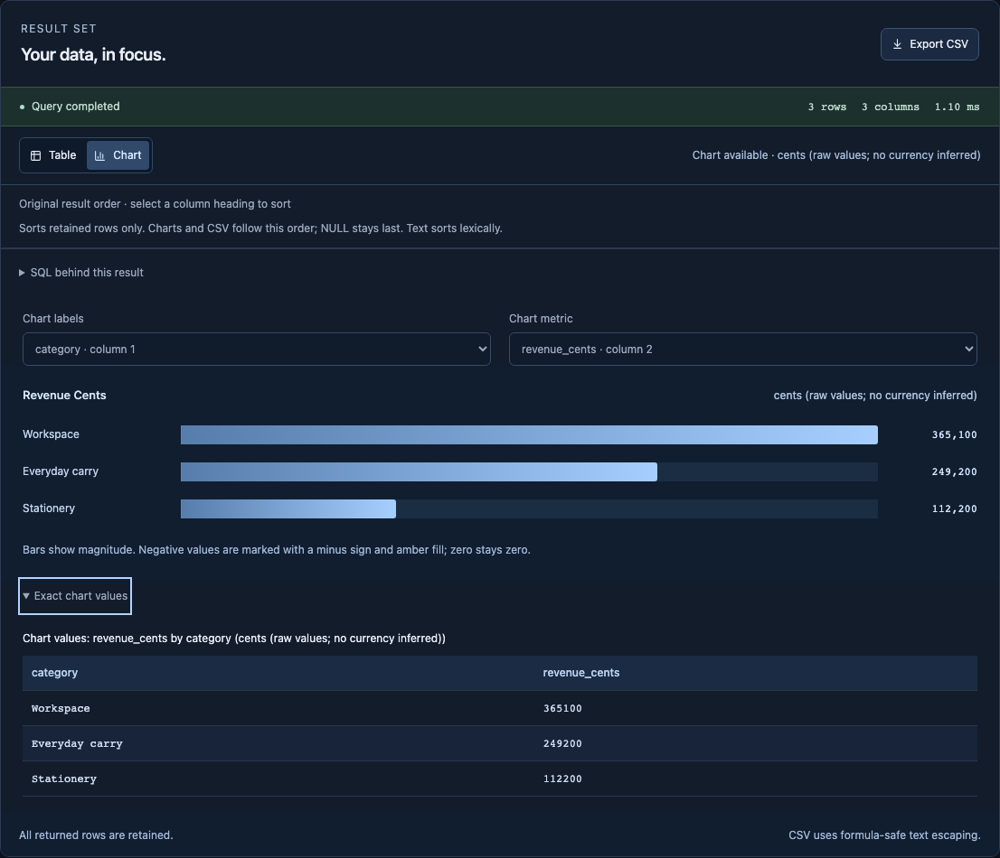

# Accessibility and human interaction

Query Lens executes read-only SQL in a bounded local SQLite WebAssembly worker. Accessibility changes use the same engine, result data and request/epoch guards; they do not introduce a simulated execution path. This document describes behavior and tested evidence, not an accessibility certification.

## Keyboard model

| Action                      | Behavior                                                                                                                                                                                                                                                                        |
| --------------------------- | ------------------------------------------------------------------------------------------------------------------------------------------------------------------------------------------------------------------------------------------------------------------------------- |
| First Tab, then Enter       | **Skip to SQL editor** bypasses schema controls and focuses the textarea.                                                                                                                                                                                                       |
| Preview a schema table      | The button names its table, loads SQL without running, and focuses the editor.                                                                                                                                                                                                  |
| Tab in SQL                  | Moves to the next native control; it does not trap focus or insert indentation.                                                                                                                                                                                                 |
| Control/Command + Enter     | Runs the current SQL when the worker is ready.                                                                                                                                                                                                                                  |
| Query failure               | The submitted SQL receives `aria-invalid` and a described error. Focus returns to the editor only if the initiating control still holds focus and that SQL remains current; an asynchronous reply cannot interrupt another control. Editing the SQL retires the invalid marker. |
| Cancel query / Retry engine | Existing worker replacement/reseed behavior runs; focus returns to the stable editor instead of a disappearing control.                                                                                                                                                         |
| Column heading              | Cycles ascending, descending and original order; the column exposes `aria-sort`.                                                                                                                                                                                                |
| Original order              | Clears sorting and restores the column-button focus, or Table view control if the chart is displayed.                                                                                                                                                                           |
| Clear query history         | Clears only history and focuses the stable Recent queries toggle.                                                                                                                                                                                                               |
| Exact chart values          | Native details/summary opens a semantic table of the selected chart labels and exact signed values.                                                                                                                                                                             |

Tab/Shift+Tab follow DOM order; Enter/Space operate native buttons and summaries. Results do not steal focus on successful background completion. Status text identifies row/column counts, truncation and stale results. Editor help explains execution and navigation before the user needs to discover shortcuts.

## Data alternatives and visible states

The complete result view is a semantic table with column headers, a caption and a keyboard-focusable scroll region. Chart mode retains a nearby **Exact chart values** table (at most 20 points) alongside the chart description, so the graphic's `role=img` does not hide the only available text values. Full Table view and formula-safe CSV remain available for every retained column. The alternative uses the same selected labels, metric and sorted rows; it neither executes SQL nor infers a currency.

Sub-12px text has a 12px floor. Buttons are at least 32px high, standalone resource links at least 24px, and schema/result summaries at least 32px; coarse pointers get 44px control heights. The table may scroll horizontally while the page reflows at 320px. Text doubling, reduced motion and forced-colors mode are exercised. High-contrast styles preserve focus, control borders and selected views; chart magnitude retains system Highlight, while exact numbers provide the non-color alternative.

## Executed evidence and remaining work

Four focused journeys in `tests/e2e/accessibility.spec.ts` cover skip/schema focus; SQL error/cancel recovery; sort reset and chart values; and 320px doubled text with forced colors/reduced motion against the production subpath and CSP. The full suite contains 19 Chromium journeys, including real WASM startup, cancellation/reseed, query policy, sorting, exports and production asset loading. All 93 domain tests still pass.

Assertions cover actual DOM focus, accessible names/descriptions, semantic tables and rendering. They do **not** prove VoiceOver/NVDA output, switch/voice-control use, physical-device target accuracy, all OS color themes, or Safari/Firefox compatibility. Doubling computed text is distinct from browser zoom. Automated axe can find structural issues but cannot certify an app's usability; screen-reader and user testing remain separate evidence.

## Design references

The implementation applies [WAI form error notification](https://www.w3.org/WAI/tutorials/forms/notifications/), [focus order](https://www.w3.org/WAI/WCAG21/Understanding/focus-order), and [complex-image alternatives](https://www.w3.org/WAI/tutorials/images/complex/). Layout choices refer to [reflow](https://www.w3.org/WAI/WCAG22/Understanding/reflow.html) and [target size](https://www.w3.org/WAI/WCAG22/Understanding/target-size-minimum.html). Focus uses [React refs](https://react.dev/learn/manipulating-the-dom-with-refs). The verification boundary follows [Playwright accessibility testing](https://playwright.dev/docs/accessibility-testing).

## Additional production-engine check

The publishing review exercises one representative task and the skip destination in Playwright Chromium and WebKit at 1440, 720, 390 and 320px. Chromium additionally checks initial and task states with axe WCAG 2/2.1/2.2 A/AA rules and broad doubled-computed-text/forced-colors rendering. This is a scoped engine check, not the complete suite in Safari or a screen-reader session. On macOS, WebKit used Option-Tab to reach links; Safari's keyboard navigation setting determines ordinary Tab behavior. See [Apple's keyboard navigation guide](https://support.apple.com/guide/safari/cpsh003/mac).
