# Architecture and execution model

Query Lens treats query text as untrusted input and the worker as a disposable execution boundary. React never runs SQLite on the main thread. The app does not pretend a CSS animation is a query: result rows, errors and elapsed time come from the actual engine.

```mermaid
flowchart LR
    Editor[Labelled SQL editor] --> Client[QueryClient / input bound]
    Client --> Watchdog[Main-thread 2-second watchdog]
    Client --> Worker[Dedicated module worker]
    Worker --> Policy[Token policy]
    Policy --> Parser[Native SQLite statement parsing]
    Parser --> DB[Seeded SQLite with query_only]
    DB --> Bound[500 rows / cell and byte limits]
    Bound --> Reply[Request-tagged result]
    Reply --> Fence[Epoch + request identity fence]
    Fence --> UI[Table / eligible chart / CSV]
    Watchdog --> Replace[Terminate and replace worker]
    Replace --> Worker
```

## Module map

| Module                       | Responsibility                                                                                                     |
| ---------------------------- | ------------------------------------------------------------------------------------------------------------------ |
| `src/domain/dataset.ts`      | Static schema, deterministic seed, trusted schema introspection and six example queries                            |
| `src/domain/sql-policy.ts`   | UTF-8/NUL/type bound, comment/quote-aware lexical envelope and blocked command/function checks                     |
| `src/domain/query-engine.ts` | Real database initialization, native statement count, actual execution, bounded/exact result conversion and timing |
| `src/domain/results.ts`      | CSV safety/quoting and conservative chart eligibility                                                              |
| `src/worker/sql.worker.ts`   | Initialize local WASM, seed DB, handle query requests and post typed replies                                       |
| `src/worker/protocol.ts`     | Typed worker messages                                                                                              |
| `src/worker/client.ts`       | Main-thread initialization/deadline timers, cancellation, worker replacement and stale-reply fencing               |
| `src/App.tsx`                | Editor/example state, explicit run commands, worker bridge and prior-result labeling                               |
| `src/components/Schema.tsx`  | Native table/column disclosure and explicit preview-query selection                                                |
| `src/components/Results.tsx` | Table, actual-value chart, NULL/large-integer display and CSV download                                             |
| `scripts/serve-dist.mjs`     | Loopback-only test host mounting the production bundle at `/query-lens/`                                           |

## Walkthrough: selecting and running monthly revenue

Selecting **Monthly revenue** replaces editor text and marks the visible earlier result as previous. It performs no SQL execution. Run captures that text and calls `QueryClient.run`. The client enforces its input envelope, assigns an increasing request ID and starts a two-second timer in the main thread before posting to the worker.

The worker repeats the policy check rather than trusting the UI. It parses SQL with `db.iterateStatements()`, allowing SQLite to understand quoted semicolons/comments/CTEs. Every prepared statement is visited and freed by the iterator lifecycle before execution; exactly one complete statement must exist. The worker then prepares that single SQL statement and steps it under SQLite's `PRAGMA query_only=ON`.

Rows are converted with `useBigInt:true`: safe integers become numbers, larger integers become exact decimal text, NULL stays null, small BLOBs become hex text, and nonfinite/oversized values are rejected. The engine retains at most 500 rows and calls `step()` once more to distinguish exactly 500 from a truncated larger result. It frees the statement in `finally`, even on error. Duration uses `performance.now()` around native preparation/execution/materialization, excludes database startup and message delivery, and is a measured observation of this run.

A result carries request ID and captured SQL. The client accepts it only from the current worker epoch/current request while running. React compares the result's SQL with current editor text; if the user edited while the worker ran, the result is correctly labelled previous. Errors similarly retain earlier output with explicit prior-result labeling. No error is presented as producing stale rows.

## Timeout, cancel and recovery

The SQLite step can be synchronous and unresponsive inside the worker. Posting a cancel message to that same worker would not interrupt it. The client instead calls `terminate()`, increments epoch, clears the watchdog and starts a fresh worker. Old replies are ignored even if cancellation raced with delivery. New work is admitted only after a `ready` message from the new epoch. The regenerated database uses the same seed, so queries see the same synthetic records.

Initialization has a separate ten-second deadline and a visible Retry action. A worker error or initialization failure stops the worker and exposes an error state. Component cleanup terminates the current worker. Paused/hidden browser tabs may throttle main-thread timers; the two-second watchdog is not a real-time operating-system guarantee. There is no durable job completion or resumability claim.

## SQL and result semantics

The lexical scanner is not marketed as a SQL parser. It understands comments, strings, doubled quotes and quoted identifiers only to enforce the safety envelope. Native SQLite parses actual statement boundaries and grammar. The pinned sql.js public API does not expose an authorizer or `sqlite3_stmt_readonly`; the implementation does not depend on unstable private WASM pointers. Native `query_only` is independently tested by bypassing the text policy and attempting writes.

SQLite's compatibility grammar also accepts single-quoted names as table identifiers. For sensitive single-quoted names (`pragma_…` and blocked function names), the engine prepares a validation-only copy with those exact token ranges replaced by expression-only parameters. Parameters can occupy literal-expression positions but cannot name tables/functions. This lets SQLite itself reject qualified, comma-joined, parenthesized, CTE and `IN table` references without maintaining a second SQL grammar. Validation statements are fully drained/freed and never stepped; original query text, literal values and returned SQL remain unchanged. A sensitive name used as a quoted alias is conservatively rejected too. The ordinary native single-statement gate still runs before actual execution.

SQLite read-only protection alone does not prevent every administrative command; therefore PRAGMA, ATTACH, DETACH, DDL, transaction controls and filesystem/extension/PRAGMA table functions are rejected by policy. Only SELECT/WITH may start a query. Some valid SQLite read-only text containing blocked administrative keywords is deliberately outside this conservative subset; quoted string contents remain ordinary values. The readonly `replace()` string function works; a CTE REPLACE mutation is rejected by native `query_only` when it returns rows and by the no-result-column guard otherwise.

Results retain positional column order, including duplicate SQL aliases. NULL is displayed as NULL; empty strings are labelled separately. BLOBs render as `0x…`. Unsafe integer values remain exact text. Nonfinite numeric results fail explicitly rather than entering chart geometry. Chart mode requires 2–20 untruncated rows, a text label column and a finite numeric column; `_cents` columns are preferred. Cents stay unconverted and no currency is inferred from a custom alias. Negative bars show magnitude with an explicit sign/amber color; zero has zero width. The table remains available for exact values.

## Bundling and browser policy

Vite builds relative asset URLs (`base:'./'`). A module worker imports `sql.js/dist/sql-wasm.wasm?url`; Vite emits the pinned binary as a local hashed asset. There is no CDN or cross-origin runtime dependency. Browser tests serve the production bundle at `/query-lens/`, check the actual WASM response path, execute SQL and verify that CSP does not block worker startup.

Production meta CSP permits same-origin script/worker/asset requests and `wasm-unsafe-eval`, needed for WebAssembly compilation; it does not permit JavaScript `unsafe-eval`. Same-origin connect is needed for WASM fetch. Inline styles support chart widths. See the security document for policy scope and hosting caveats. Development omits CSP for HMR.

## Primary references consulted

Checked during implementation on 17 September 2026:

- [sql.js repository and local WASM loading](https://github.com/sql-js/sql.js): engine licensing, npm binary and `locateFile`.
- [Database API](https://sql.js.org/documentation/Database.html), [Statement API](https://sql.js.org/documentation/Statement.html) and [StatementIterator](https://sql.js.org/documentation/StatementIterator.html): real execution, resource release and native parsing.
- Installed sql.js 1.14.2 source: `get(...,{useBigInt:true})`, iterator cleanup and browser entry behavior. The type package lacks the BigInt option, so one narrow typed adapter documents the mismatch.
- [SQLite query_only](https://www.sqlite.org/pragma.html#pragma_query_only), [hard_heap_limit](https://www.sqlite.org/pragma.html#pragma_hard_heap_limit) and [implementation limits](https://sqlite.org/limits.html): defense scope and resource limits.
- [SQLite stmt_readonly](https://www.sqlite.org/c3ref/stmt_readonly.html): considered but not exposed through this pinned public binding.
- [SQLite quoting compatibility](https://www.sqlite.org/lang_keywords.html) and [SELECT grammar](https://www.sqlite.org/lang_select.html): single quotes can denote identifiers in identifier-only positions; native parameter validation distinguishes these from ordinary values.
- [OWASP CSV injection](https://owasp.org/www-community/attacks/CSV_Injection): dangerous spreadsheet prefixes and export caveats.
- [Vite workers](https://vite.dev/guide/features.html#web-workers) and [static deployment](https://vite.dev/guide/static-deploy.html): module worker and relative subpath assets.
