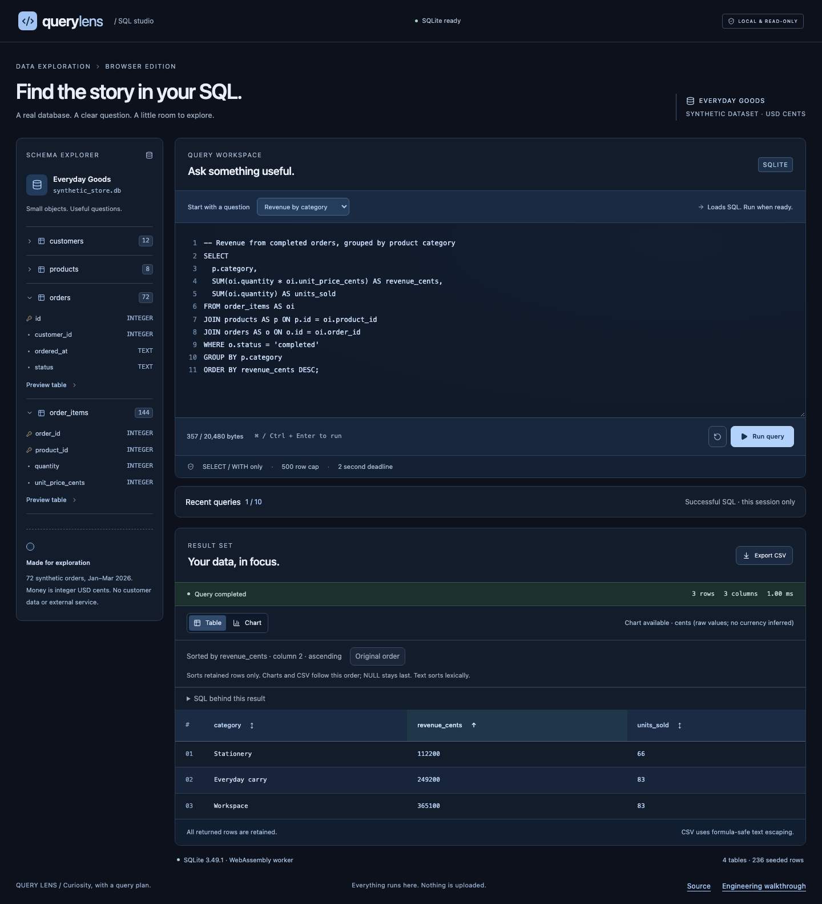

# A three-minute engineering review

Query Lens is a recent AI-assisted portfolio demonstration. Its [browser workbench](https://nen-io.github.io/query-lens/) runs real SQLite WASM against a disclosed synthetic dataset in a dedicated worker; no hosted database or model is involved.

## Try the behavior

1. Run **Revenue by category**. SQLite returns 365100, 249200 and 112200 cents. Choose **Chart** and switch its metric to `units_sold`; the values come from the same captured rows.
2. Return to **Table** and activate `revenue_cents` to sort ascending, descending and back to original order. Headers expose their direction to assistive technology. Export CSV; it follows the displayed order. Sorting is a local view of retained rows, not a rewrite or rerun of SQL.
3. Run `SELECT 'ten' AS label, 10 AS value UNION ALL SELECT 'two', 2 UNION ALL SELECT 'missing', NULL;`. Sort the numeric column. Two precedes ten; NULL remains last in both directions. Numeric-looking text stays text.
4. Run `SELECT FROM invalid`. The old data and sort remain with an explicit **Previous result** label. Open **SQL behind this result** or recent history to recover SQL without executing it.



## Follow one hard edge

Read [the worker client](../src/worker/client.ts), [SQL policy](../src/domain/sql-policy.ts) and [query engine](../src/domain/query-engine.ts). The browser timeout terminates a worker executing expensive native WASM, then reseeds a fresh worker. Request/epoch checks reject stale responses; cancellation does not manufacture a success or add history. SQLite `query_only` is another layer alongside a conservative SQL gate and strict result limits.

[The Chromium journeys](../tests/e2e/query-lens.spec.ts) execute an expensive query, cancel or time it out, then run a real successful query. They also verify the production worker/WASM beneath the repository subpath and CSP. [Result tests](../tests/unit/results.test.ts) cover stable sorting, duplicate aliases, exact integer text and CSV formula escaping.

## Reproduce the proof

```sh
nvm use
npm ci
npx playwright install chromium
npm run check
npm run test:e2e
```

## Boundary to discuss

The dataset is fixed synthetic data, and the workbench is memory-only. The 500-row/1 MiB response limits protect rendering; sorting a truncated result cannot order rows that were not retained. Mixed types sort by their represented type, with deterministic case-sensitive text order; this is not an emulation of every SQLite collation. Exact integers beyond JavaScript precision remain decimal text. No database uploads, network query API or cross-user persistence are implemented. See [security](SECURITY.md), [scaling](SCALABILITY.md), [decisions](DECISIONS.md) and [testing limits](TESTING.md).
